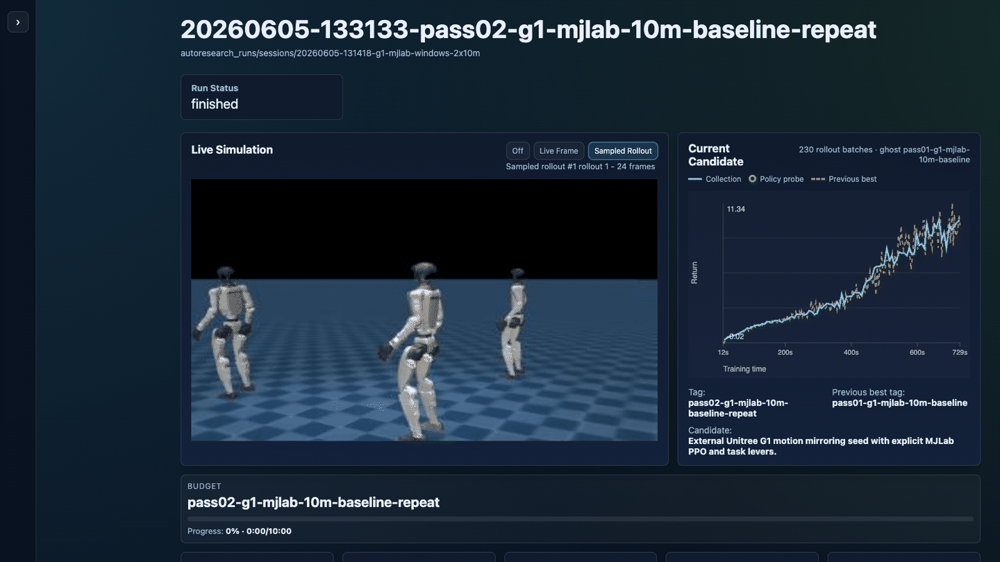
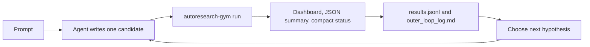

# Autoresearch Gym

Autoresearch Gym is a Gymnasium workbench for running agent-driven reinforcement
learning research loops under fixed benchmark contracts. It gives Codex, Claude
Code, or another coding agent the pieces it needs to author one candidate at a
time, run deterministic evaluation, inspect live metrics and frames, and choose
the next hypothesis from the evidence.

The project follows the Karpathy `autoresearch` pattern: the repo provides
benchmarks, seed trainables, a runner, and a live dashboard; the external coding
agent provides the research judgment and edits session-local candidate files.



## Installation Setup

Create a Python 3.10 environment and install the simulator stack you need:

```bash
cd autoresearch-gym
uv venv --seed --python 3.10 .venv
uv sync --extra mujoco
```

Useful extras:

```bash
uv sync --extra mujoco  # Hopper, InvertedPendulum, FetchPush, SO-101 reach
uv sync --extra mujoco-warp  # Menagerie Panda MuJoCo/MJWarp task
uv sync --extra panda   # Panda/PyBullet and PandaGym tasks
uv sync --extra dev     # tests and development tools
```

On Apple Silicon, install `panda-gym` without its upstream `pybullet`
dependency after syncing the `panda` extra:

```bash
uv pip install --no-deps "panda-gym==3.0.7"
```

Windows PowerShell uses the same `uv sync --extra ...` commands. For NVIDIA
CUDA Torch wheels, use the current command from the official PyTorch selector
after syncing the desired extra. See [docs/INSTALL.md](docs/INSTALL.md) for the
full platform notes.

Check the resolved accelerator before longer runs:

```bash
uv run autoresearch-gym doctor --strict
```

`doctor` reports the PyTorch build, selected training device, and any NVIDIA
GPUs visible through `nvidia-smi`. It exits nonzero in `--strict` mode when an
NVIDIA GPU is present but the current Python environment has CPU-only Torch.

Bundled tasks:

| Task | Benchmark | Seed |
| --- | --- | --- |
| Hopper | `autoresearch_gym/tasks/hopper_v0/benchmark.json` | `autoresearch_gym/tasks/hopper_v0/seed_trainable.py` |
| Hopper vectorized wall-clock | `autoresearch_gym/tasks/hopper_v0/benchmark_vectorized_wall_clock.json` | `autoresearch_gym/tasks/hopper_v0/seed_trainable_vectorized.py` |
| InvertedPendulum | `autoresearch_gym/tasks/inverted_pendulum_v5/benchmark.json` | `autoresearch_gym/tasks/inverted_pendulum_v5/seed_trainable.py` |
| FetchPushDense | `autoresearch_gym/tasks/fetch_push_dense_v0/benchmark.json` | `autoresearch_gym/tasks/fetch_push_dense_v0/seed_trainable.py` or `seed_trainable_her.py` |
| Panda pick-and-place | `autoresearch_gym/tasks/panda_pick_and_place_v0/benchmark.json` | `autoresearch_gym/tasks/panda_pick_and_place_v0/seed_trainable.py` or `seed_trainable_her.py` |
| Panda pick-and-place MuJoCo/MJWarp | `autoresearch_gym/tasks/panda_pick_and_place_mjwarp_v0/benchmark_wall_clock.json` | `autoresearch_gym/tasks/panda_pick_and_place_mjwarp_v0/seed_trainable.py` or `seed_trainable_tqc_her_ee.py` |
| Panda-gym dense pick-and-place MuJoCo/MJWarp | `autoresearch_gym/tasks/panda_pick_and_place_mjwarp_pandagym_dense_v0/benchmark_wall_clock.json` | `autoresearch_gym/tasks/panda_pick_and_place_mjwarp_pandagym_dense_v0/seed_trainable_tqc_her_ee.py` or `seed_trainable_guided_warmup.py` |
| SO-101 reach MuJoCo | `autoresearch_gym/tasks/so101_reach_mujoco_v0/benchmark.json` | `autoresearch_gym/tasks/so101_reach_mujoco_v0/seed_trainable.py` |
| SO-101 reach MuJoCo vectorized wall-clock | `autoresearch_gym/tasks/so101_reach_mujoco_v0/benchmark_vectorized_wall_clock.json` | `autoresearch_gym/tasks/so101_reach_mujoco_v0/seed_trainable_vectorized.py` |
| SO-101 reach MuJoCo Warp wall-clock | `autoresearch_gym/tasks/so101_reach_mujoco_v0/benchmark_mjwarp_wall_clock.json` | `autoresearch_gym/tasks/so101_reach_mujoco_v0/seed_trainable_vectorized.py` |
| SO-101 cube-to-bin MuJoCo | `autoresearch_gym/tasks/so101_cube_to_bin_mujoco_v0/benchmark.json` | `autoresearch_gym/tasks/so101_cube_to_bin_mujoco_v0/seed_trainable.py` |
| SO-101 cube-to-bin MuJoCo Warp wall-clock | `autoresearch_gym/tasks/so101_cube_to_bin_mujoco_v0/benchmark_mjwarp_wall_clock.json` | `autoresearch_gym/tasks/so101_cube_to_bin_mujoco_v0/seed_trainable_vectorized.py` |
| SO-101 vial-to-rack MuJoCo | `autoresearch_gym/tasks/so101_vial_to_rack_mujoco_v0/benchmark.json` | `autoresearch_gym/tasks/so101_vial_to_rack_mujoco_v0/seed_trainable.py` |
| SO-101 vial-to-rack MuJoCo Warp wall-clock | `autoresearch_gym/tasks/so101_vial_to_rack_mujoco_v0/benchmark_mjwarp_wall_clock.json` | `autoresearch_gym/tasks/so101_vial_to_rack_mujoco_v0/seed_trainable_vectorized.py` |
| Panda bat-to-goal | `autoresearch_gym/tasks/bat_to_goal_v0/benchmark.json` | `autoresearch_gym/tasks/bat_to_goal_v0/seed_trainable.py` |
| Panda bat-to-goal vectorized wall-clock | `autoresearch_gym/tasks/bat_to_goal_v0/benchmark_vectorized_wall_clock.json` | `autoresearch_gym/tasks/bat_to_goal_v0/seed_trainable_vectorized.py` |
| Unitree G1 motion mirror external | `autoresearch_gym/tasks/unitree_g1_motion_mirror_v0/benchmark.json` | `autoresearch_gym/tasks/unitree_g1_motion_mirror_v0/seed_trainable.py` |
| Unitree G1 lower-level CleanRL external | `autoresearch_gym/tasks/unitree_g1_motion_mirror_v0/benchmark_lower_level.json` | `autoresearch_gym/tasks/unitree_g1_motion_mirror_v0/seed_trainable_lower_level_cleanrl.py` |
| Unitree Go2 rough locomotion external | `autoresearch_gym/tasks/unitree_go2_rough_locomotion_v0/benchmark.json` | `autoresearch_gym/tasks/unitree_go2_rough_locomotion_v0/seed_trainable.py` |
| Unitree Go2 lower-level CleanRL external | `autoresearch_gym/tasks/unitree_go2_rough_locomotion_v0/benchmark_lower_level.json` | `autoresearch_gym/tasks/unitree_go2_rough_locomotion_v0/seed_trainable_lower_level_cleanrl.py` |

The SO-101 MuJoCo tasks use MuJoCo Menagerie's `robotstudio_so101` model when
available. Set `AUTORESEARCH_SO101_MJCF`, set `MUJOCO_MENAGERIE_PATH`, or clone
Menagerie into `.external/mujoco_menagerie` so
`.external/mujoco_menagerie/robotstudio_so101/so101.xml` exists. These tasks
fail closed when the real RobotStudio/Menagerie SO-101 assets are missing; the
manipulation tasks add simple MuJoCo cube, bin, vial, and rack geometry around
the real arm model. SO-101 manipulation dense rewards follow the normalized
pick-and-place shaping used by SO101-Nexus v0.3.12: reach progress, grasp
signal, grasp-gated placement progress, and completion bonus. Credit:
https://pypi.org/project/so101-nexus-mujoco/

External Unitree tasks use an `execution_backend` plus an `execution_target`.
Bundled task files default to `execution_target = "local"` so a Windows or
Linux machine with the simulator stack installed can run them directly. To run
the same benchmark from another machine, pass `--execution-target <name>` and
keep machine-specific SSH hosts, remote roots, and account names in ignored
target config such as `.autoresearch.local.toml` or
`~/.config/autoresearch-gym/targets.toml`; see
`examples/remote_targets.example.toml`.

### Unitree Local And Remote Execution

The Unitree G1 and Go2 tasks are external-environment tasks. The benchmark owns
the fixed eval contract, the seed owns the trainable recipe, and the runner
decides where the simulator executes. The same seed file should work in local
and remote mode.

The MJLab-backed variants use:

- `unitree_g1_motion_mirror_v0/benchmark.json` with `seed_trainable.py`
- `unitree_go2_rough_locomotion_v0/benchmark.json` with `seed_trainable.py`

G1 motion mirroring minimizes tracking error. Go2 rough locomotion maximizes
MJLab rollout return; it does not use a fabricated binary success metric.

These paths expect the upstream simulator repositories under `.external/` in
the checkout where the harness runs. G1 motion mirroring also expects its source
motion file under `autoresearch_runs/source_motions/`.

Run locally on the simulator machine:

```bash
uv run autoresearch-gym run \
  --benchmark autoresearch_gym/tasks/unitree_g1_motion_mirror_v0/benchmark.json \
  --seed-candidate autoresearch_gym/tasks/unitree_g1_motion_mirror_v0/seed_trainable.py \
  --candidate autoresearch_gym/tasks/unitree_g1_motion_mirror_v0/seed_trainable.py \
  --tag g1-mjlab-smoke \
  --train-episodes 1 \
  --eval-episodes 1
```

Run from a MacBook or other controller while delegating the simulator to an SSH
target:

```bash
uv run autoresearch-gym run \
  --benchmark autoresearch_gym/tasks/unitree_go2_rough_locomotion_v0/benchmark.json \
  --seed-candidate autoresearch_gym/tasks/unitree_go2_rough_locomotion_v0/seed_trainable.py \
  --candidate autoresearch_gym/tasks/unitree_go2_rough_locomotion_v0/seed_trainable.py \
  --tag go2-mjlab-remote-smoke \
  --train-episodes 1 \
  --eval-episodes 1 \
  --execution-target windows_gpu
```

Private SSH settings belong in ignored target config, not in benchmark files or
seeds. The public example uses `artifact_sync = "scp"`, which is the supported
SSH artifact sync mode.

The same `--execution-target` switch also works for ordinary in-process
Gymnasium benchmarks when the remote checkout can import the benchmark and seed
dependencies. In that mode the local process still owns the autoresearch
session, candidate selection, final `results.jsonl`, and dashboard path; the
runner stages the selected benchmark/candidate files, runs
`autoresearch-gym run` on the SSH target, periodically mirrors live dashboard
artifacts back into the local session, then fetches the final run directory.
Use this for GPU-native simulators such as MuJoCo Warp:

```bash
uv run autoresearch-gym run \
  --benchmark autoresearch_gym/tasks/panda_pick_and_place_mjwarp_v0/benchmark_wall_clock.json \
  --session-dir autoresearch_runs/sessions/<session-id> \
  --candidate autoresearch_runs/sessions/<session-id>/candidates/pass01_baseline.py \
  --tag pass01-baseline \
  --execution-target windows_gpu \
  --compact-status \
  --compact-status-file autoresearch_runs/sessions/<session-id>/live/status.log
```

Before launching a remote in-process run, sync or verify the remote checkout is
current with the local intended code. The target runner stages the benchmark,
eval-case bank, and active candidate file, but it does not copy arbitrary local
package edits or simulator dependencies.

The lower-level CleanRL variants use:

- `unitree_g1_motion_mirror_v0/benchmark_lower_level.json` with
  `seed_trainable_lower_level_cleanrl.py`
- `unitree_go2_rough_locomotion_v0/benchmark_lower_level.json` with
  `seed_trainable_lower_level_cleanrl.py`

Those seeds expose a more editable training-control surface directly in the
candidate file. They are intended for recipe evolution and smoke validation of
the lower-level path; short smoke runs validate harness and artifact plumbing,
not final policy quality.

## Testing Seed Performance Of A Task (With Dashboard)

Use a session directory when you want the dashboard, live artifacts, and a
repeatable baseline record.

Start the dashboard in one terminal:

```bash
uv run autoresearch-gym dashboard --port 4174
```

Create a session:

```bash
uv run autoresearch-gym init-session \
  --label inverted-pendulum-seed-smoke \
  --benchmark autoresearch_gym/tasks/inverted_pendulum_v5/benchmark_wall_clock.json \
  --seed-candidate autoresearch_gym/tasks/inverted_pendulum_v5/seed_trainable.py
```

Copy the seed into the session as pass 1:

```bash
cp autoresearch_gym/tasks/inverted_pendulum_v5/seed_trainable.py \
  autoresearch_runs/sessions/<session-id>/candidates/pass01_baseline.py
```

Run the seed under the fixed benchmark, with a short override if you just want a
smoke test:

```bash
uv run autoresearch-gym run \
  --benchmark autoresearch_gym/tasks/inverted_pendulum_v5/benchmark_wall_clock.json \
  --session-dir autoresearch_runs/sessions/<session-id> \
  --candidate autoresearch_runs/sessions/<session-id>/candidates/pass01_baseline.py \
  --tag pass01-baseline \
  --train-seconds 45 \
  --eval-episodes 5 \
  --compact-status \
  --compact-status-file autoresearch_runs/sessions/<session-id>/live/status.log
```

Open:

```text
http://127.0.0.1:4174/dashboard/?session=autoresearch_runs/sessions/<session-id>
```

The dashboard can also be opened bare at `/dashboard/`; it resolves the latest
live session first, then falls back to `autoresearch_runs/sessions/latest`.

For a quick terminal-only smoke test without session artifacts:

```bash
uv run autoresearch-gym run \
  --benchmark autoresearch_gym/tasks/hopper_v0/benchmark.json \
  --seed-candidate autoresearch_gym/tasks/hopper_v0/seed_trainable.py \
  --tag smoke \
  --train-episodes 2 \
  --eval-episodes 1 \
  --no-record
```

## Launching A Multi-Pass Autoresearch Session

Ask the coding agent to read [AUTORESEARCH.md](AUTORESEARCH.md) before it starts
mutating candidates. The short version is:

1. Initialize a session from a fixed benchmark and seed.
2. Copy the selected seed verbatim to `candidates/pass01_baseline.py`.
3. Run pass 1.
4. For each later pass, inspect the latest evidence, write one new
   `candidates/passNN_<slug>.py`, run that already-authored candidate, then
   classify it as `screening_leader`, `frontier`, or `reject` based on fixed
   eval and logged secondary evidence.
5. Do not prewrite a queue of candidates. The next pass can come from an idea
   backlog or from a new observation in the previous run.

Example prompts:

- "Run a 10 x 45 second InvertedPendulum autoresearch loop. Pick the next pass
  sequentially from the evidence at hand instead of planning all candidates up
  front."
- "Take 20 creative 2-minute InvertedPendulum passes from the current best
  candidate, run headless to save compute, and stop early if the benchmark maxes
  out."
- "Run Hopper for a 5-minute wall-clock budget with the dashboard enabled and a
  compact status log I can tail while the agent works."
- "Compare FetchPushDense SAC and SAC+HER from their seeds, then mutate only one
  session-local candidate at a time based on fixed eval results."

For longer runs, use a compact status file so humans and agents can monitor
progress without parsing the final JSON summary:

```bash
uv run autoresearch-gym run \
  --benchmark autoresearch_gym/tasks/<task_name>/<benchmark>.json \
  --session-dir autoresearch_runs/sessions/<session-id> \
  --candidate autoresearch_runs/sessions/<session-id>/candidates/passNN_<slug>.py \
  --tag passNN-<slug> \
  --compact-status \
  --compact-status-file autoresearch_runs/sessions/<session-id>/live/status.log \
  --status-interval-seconds 10
```

Tail it while the run continues:

```bash
tail -f autoresearch_runs/sessions/<session-id>/live/status.log
```

Final stdout remains the full JSON summary. The compact file is intentionally
for live monitoring.



## Gotchas And Notes From Mac, Windows, Claude, And Codex

- Read [AUTORESEARCH.md](AUTORESEARCH.md) for running sessions and
  [AGENTS.md](AGENTS.md) for package maintenance. The README intentionally does
  not duplicate the full candidate contract.
- Use `benchmark.json` for episode-budget comparisons and
  `benchmark_wall_clock.json` for fixed-time learning-efficiency comparisons.
  Do not compare results across budget types unless you label the comparison as
  budget-mismatched.
- Candidate files must live under the session-local `candidates/` directory.
  Pass 1 should be a verbatim copy of the selected seed.
- Keep stdout clean for the final JSON summary. Use `--compact-status-file` for
  live monitoring, especially with Claude Code or Codex runs where streamed
  terminal output may be buffered, summarized, or hidden.
- Training curves are part of the public runner contract. New seeds should emit
  typed `episode_records`: `train_episode`, `train_collection_window`, and, via
  runner-owned deterministic checks, `policy_probe`. Old run artifacts without
  `record_type` still render as collection episodes for dashboard compatibility.
  In live metrics and train summaries, `total_steps`/`env_steps` are cumulative
  environment transitions across all vector envs; `episodes_completed` is total
  completed rollouts; `episode_batches` is the number of chart/logging records.
  For `train_collection_window`, the record's `episode` field is the episode
  batch index and `episodes_in_window` is the number of rollouts summarized.
- Deterministic train-time probes are enabled by default when the agent exposes
  `act(obs, deterministic=True)`. Use `--no-train-probe` for throughput-only
  timing, or override cadence with `--probe-interval-seconds` and
  `--probe-episodes`.
- Claude Code, and sometimes Codex, may try to batch-plan several candidates up
  front. Push the agent back to the strict autoresearch loop: write one
  candidate, run it, inspect the evidence, update the research log, then choose
  the next candidate. Preplanned batches do not learn from the experiments they
  have not run yet.
- Watch `outer_loop_log.md`. Agents sometimes skip the research log unless
  explicitly told to record the hypothesis, changed mechanism, result, decision,
  interpretation, and next idea after every pass.
- Agents can also rat-hole on tuning one parameter for many passes. When that
  happens, push for broader and more diverse changes: replay behavior,
  exploration, architecture, losses, reward transforms, vectorization, warmup,
  update cadence, or task-specific priors.
- Keep the dashboard server running for normal sessions. Turn off expensive
  visualization from the dashboard when stepping away, or use `--headless-env`
  for MuJoCo runs when you do not need environment-level RGB rendering.
- `--headless-env` records runtime conditions in the final summary. PandaGym /
  PyBullet environments may reject `render_mode=None`; in that case the runner
  keeps the benchmark render mode and records the fallback.
- On macOS, MuJoCo rendering can fail in restrictive sandboxes because CGL/GLFW
  needs a real WindowServer connection. Verify render failures from a normal
  GUI-permitted shell before changing benchmark or runner code.
- On Windows, use PowerShell and install CUDA Torch wheels from the official
  PyTorch selector if you want NVIDIA GPU acceleration. Verify CUDA before
  launching long Hopper/vectorized runs.
- Generated sessions, checkpoints, media, logs, and `autoresearch_runs/`
  artifacts are local research output. Do not publish them unless you have
  deliberately curated small examples such as the README media.
